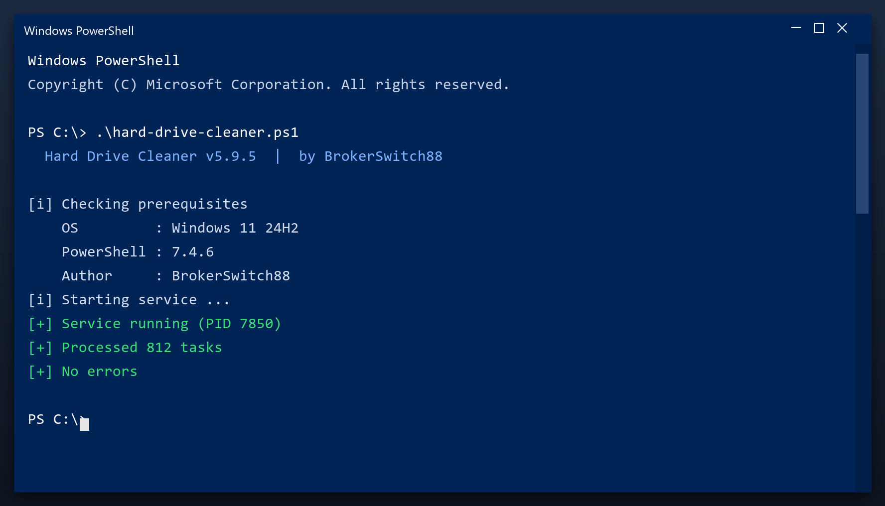

# Hard Drive Cleaner — Free Download [2026]

 

**Hard drive cleaner** is a maintenance tool for Windows written to be simple: one window, plain settings, no confusing options. Download it, run a scan, done. **Free to use, no strings attached.**

| | |
| --- | --- |
| **Program** | Hard Drive Cleaner |
| **Version** | Latest 2026 build |
| **Price** | Free |
| **Systems** | see requirements below |
| **Download** | Quick Start section below |

## Is this tool safe?

| **Problem** | **Solution** |
| --- | --- |
| **Long boot time** | Trim the startup list |
| **Random crashes** | Fix broken registry links |
| **Full temp folder** | Clear caches in one pass |
| **Slow in games** | Stop background tasks |
| **Unknown files** | See exactly what is safe to remove |

## Does it really work?

- **Slow performance** - too many background programs start with Windows
- **Cluttered disk** - temporary files and leftovers build up over time
- **Registry errors** - broken entries cause errors and crashes
- **Hard to find settings** - Windows hides the useful options
- **Bundled junk** - many free tools install adware or toolbars

  

  

## How do I install it?

1. **Download** the file below
2. **Run** the installer and follow the steps
3. **Open** the tool and press Scan
4. **Review** what it found
5. **Apply** the fixes - a restore point is created first

> **Note:** run the tool as administrator so it can clean system folders. Without admin rights it will only touch your own user files.

## What will I get?

| **Component** | **Details** |
| --- | --- |
| **Executable** | The tool itself |
| **Config** | Defaults already set |
| **Guide** | Plain-language walkthrough |
| **Support** | Issues section in this repo |

## What does it need?

| **Component** | **Details** |
| --- | --- |
| **OS** | Windows 10, 11 |
| **Architecture** | 64-bit |
| **RAM** | 2 GB minimum |
| **Disk space** | 100 MB |
| **Admin rights** | Yes, for cleanup tasks |
| **Internet** | Only to download |

## More questions

**Is it free?**

Yes - no cost and no subscription.

**Is it a virus?**

No. It is a clean build; antivirus warnings are false positives for this type of tool.

**Can it break my PC?**

No - it makes a backup first, so any change can be undone.

**How often should I run it?**

Once a month is enough for most computers.

**The download does not start - what now?**

Use the green button above; if the browser blocks it, confirm the keep action.

## Notes

- Start with a quick scan before a deep scan
- Deep scans take longer but find more
- Check free space before and after
- Note any errors and check the FAQ
- Repeat monthly for consistent speed

---

*rebel-fern-198 · Updated 2026-10-09 · Shared under the MIT License*
